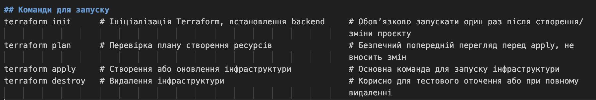

# 	# Мій власний мікросервісний проєкт  
Це репозиторій для навчального проєкту в межах курсу "DevOps CI/CD".  
# Terraform Infrastructure Project

Цей проєкт автоматизує розгортання хмарної інфраструктури за допомогою Terraform, використовуючи модульний підхід і віддалене зберігання стану.

---

## Використані модулі
#s3-backend/
Створює S3 bucket для зберігання стану Terraform

Створює DynamoDB таблицю для блокування стану (state locking)

Використовується для backend.tf

# vpc/
Створює VPC з CIDR-блоком

Налаштовує публічні та приватні підмережі, інтернет-шлюз, маршрутизацію

База для подальших ресурсів (EC2, RDS, тощо)

# ecr/
Створює Elastic Container Registry (ECR) репозиторій

Використовується для зберігання Docker-образів, що будуть розгорнуті