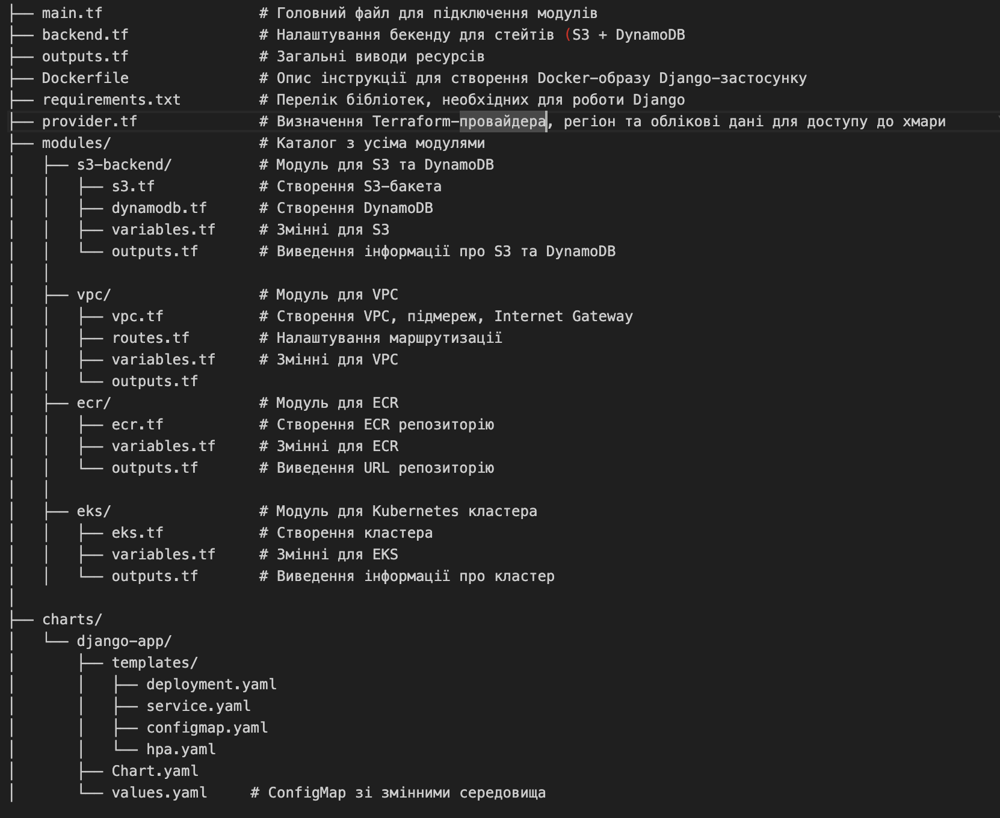
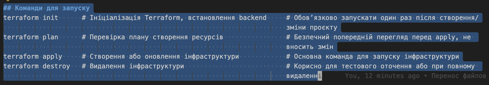

# 	# Мій власний мікросервісний проєкт  
Це репозиторій для навчального проєкту в межах курсу "DevOps CI/CD".  
# Terraform Infrastructure Project

Цей проєкт автоматизує розгортання хмарної інфраструктури за допомогою Terraform, використовуючи модульний підхід і віддалене зберігання стану.

---

## Структура проєкту

├── main.tf                  # Головний файл для підключення всіх модулів
├── backend.tf               # Налаштування бекенду для стейтів (S3 + DynamoDB)
├── outputs.tf               # Експортує створені ресурси
├── provider.tf              # Налаштування AWS-провайдера та регіону│
├── modules/                 # Каталог з усіма модулями
│   │
│   ├── s3-backend/          # Модуль для S3 та DynamoDB
│   │   ├── s3.tf            # Створення S3-бакета
│   │   ├── dynamodb.tf      # Створення DynamoDB
│   │   ├── variables.tf     # Змінні для S3
│   │   └── outputs.tf       # Виведення інформації про S3 та DynamoDB
│   │
│   ├── vpc/                 # Модуль для VPC
│   │   ├── vpc.tf           # Створення VPC, підмереж, Internet Gateway
│   │   ├── routes.tf        # Налаштування маршрутизації
│   │   ├── variables.tf     # Змінні для VPC
│   │   └── outputs.tf       # Виведення інформації про VPC
│   │
│   └── ecr/                 # Модуль для ECR
│       ├── ecr.tf           # Створення ECR репозиторію
│       ├── variables.tf     # Змінні для ECR
│       └── outputs.tf       # Виведення URL репозиторію ECR
│
└── README.md                # Документація проєкту

## Команди для запуску
terraform init      # Ініціалізація Terraform, встановлення backend     # Обов’язково запускати один раз після створення/
                                                                        зміни проєкту
terraform plan      # Перевірка плану створення ресурсів                # Безпечний попередній перегляд перед apply, не 
                                                                        вносить змін
terraform apply     # Створення або оновлення інфраструктури            # Основна команда для запуску інфраструктури
terraform destroy   # Видалення інфраструктури                          # Корисно для тестового оточення або при повному 
                                                                        видаленні

## Використані модулі
#s3-backend/
Створює S3 bucket для зберігання стану Terraform

Створює DynamoDB таблицю для блокування стану (state locking)

Використовується для backend.tf

# vpc/
Створює VPC з CIDR-блоком

Налаштовує публічні та приватні підмережі, інтернет-шлюз, маршрутизацію

База для подальших ресурсів (EC2, RDS, тощо)

# ecr/
Створює Elastic Container Registry (ECR) репозиторій

Використовується для зберігання Docker-образів, що будуть розгорнуті